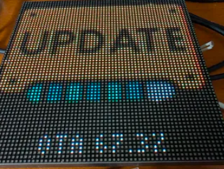
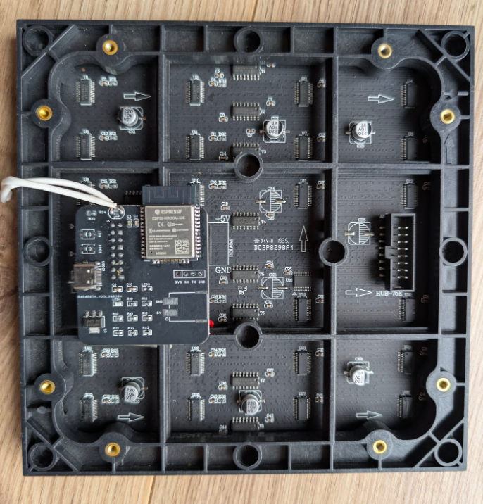
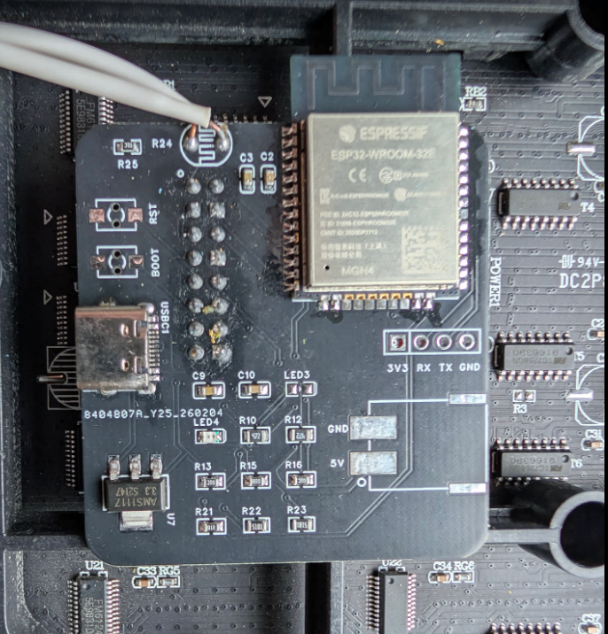
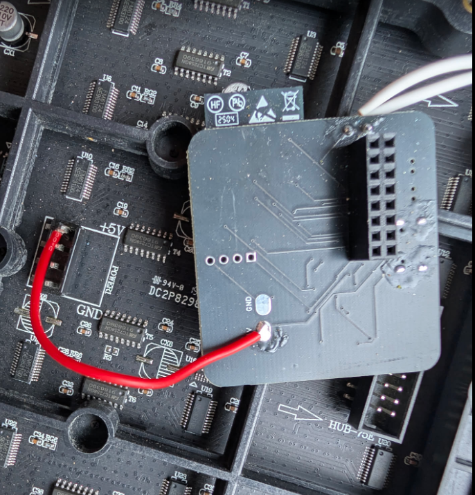

# Clockwise ESP32 Custom Firmware

**Custom firmware & soldering-free OTA flash method for the "ClockWise Plus" ESP32 HUB75 64x64 LED matrix pixel clock sold on AliExpress.**

The stock firmware (by topyuan.top) has no user-accessible OTA upload and the USB-C port is **power-only** (no data lines). This project documents how to replace the firmware over WiFi using DNS spoofing of the built-in auto-update mechanism — no soldering, no serial adapter needed.



## Hardware

This is a 64x64 RGB LED matrix panel (HUB75E, P3 pitch) with a custom ESP32 controller board plugged into the back via the standard HUB75 16-pin connector.

| Component | Details |
|-----------|---------|
| MCU | ESP32-WROOM-32E (ESP32-D0WD-V3 rev 3.1), Dual Core, 240MHz |
| Display | 64x64 RGB LED matrix, HUB75E interface, FM6126A driver IC |
| USB-C | **Power only** — no D+/D- data lines connected |
| Serial header | 4-pin pad H2 (3V3, RX, TX, GND) — unpopulated |
| Buttons | BOOT (IO0 / SW5) + RESET (EN / SW4) — may be unpopulated |
| LDR | GPIO 34 (analog, for auto-brightness) |
| Buzzer | GPIO 2 (via transistor) |
| Power | 5V via USB-C, AMS1117-3.3 regulator for ESP32 |





### HUB75E Pin Mapping

Extracted from the [PCB schematic](schematic/clockwise-pcb-schematic.pdf) and confirmed by binary analysis of the stock firmware:

| HUB75E Pin | Signal | ESP32 GPIO |
|-----------|--------|------------|
| 1 | R1 | IO25 |
| 2 | G1 | IO26 |
| 3 | B1 | IO27 |
| 4 | GND | - |
| 5 | R2 | IO14 |
| 6 | G2 | IO12 |
| 7 | B2 | IO13 |
| 8 | E | **unknown — see [Display Issues](#display-issues)** |
| 9 | A | IO23 |
| 10 | B | IO19 |
| 11 | C | IO5 |
| 12 | D | IO17 |
| 13 | CLK | IO16 |
| 14 | LAT | IO4 |
| 15 | OE | IO15 |
| 16 | GND | - |

> **Note:** Pins R1 through D and CLK/LAT/OE were confirmed by extracting the `i2s_pins` struct from the stock firmware binary at offset `0x0019c6`. The stock firmware compiles with **E=-1** (not connected) in the pin struct, yet drives a 64x64 panel correctly. The E pin is likely set at runtime or the panel uses a non-standard scan method. See [Display Issues](#display-issues).

## Stock Firmware: ClockWise Plus

The stock firmware is "ClockWise Plus" by topyuan.top (based on the open-source [Clockwise](https://github.com/jnthas/clockwise) project). It features animated clock faces (Super Mario, Pac Man, Nyan Cat, etc.) configurable via a web interface.

### Stock Firmware API

The clock exposes a web server on port 80:

| Endpoint | Method | Purpose |
|----------|--------|---------|
| `/get` | GET | Returns all settings as HTTP **headers** (204 response) |
| `/set` | POST | Save a setting (`key=value` form data) |
| `/restart` | POST | Reboot device |
| `/erase` | POST | Erase WiFi credentials |
| `/read?pin=N` | GET | Read analog pin value |
| `/basic` | GET | Fallback config page |

### Stock OTA Protocol (Reverse-Engineered)

The firmware checks for updates over plain HTTP:

1. **Heartbeat**: `GET http://www.topyuan.top/ledhub75/check?id=<chipid>&ver=<version>&...`
2. **Update check**: `GET http://www.topyuan.top/ledhub75/updatecheck?id=<chipid>&ver=<version>`
   - Server returns the latest version as plain text (e.g., `3.11`)
3. **Firmware download** (if server version > local version):
   `GET http://www.topyuan.top/ledhub75/firmware/<version>.bin`

All communication uses **plain HTTP** (not HTTPS) to `www.topyuan.top` (port 80).

The firmware files are publicly browsable at `https://topyuan.top/ledhub75/firmware/`.

**Security note**: The stock firmware sends your WiFi SSID and password in plain text to topyuan.top on every check-in. The heartbeat URL includes `&ssid=...&pass=...` as query parameters.

## Flashing Custom Firmware (No Soldering)

### Prerequisites

- A machine on the same network as the clock
- Control over your DNS server (or the ability to override DNS for one host)
- Python 3
- nginx (or any HTTP server/reverse proxy on port 80)
- [PlatformIO](https://platformio.org/) (to compile firmware)

### Step 1: Build the Bridge Firmware

The bridge firmware connects to your WiFi, drives the display with a test pattern, and provides a web-based OTA upload at `http://<clock-ip>/update` for all future flashing.

```bash
cd bridge-firmware

# Edit src/main.cpp — set your WiFi SSID and password
# (lines 23-24)

platformio run
```

The compiled binary will be at `.pio/build/esp32/firmware.bin`.

### Step 2: Set Up the OTA Spoof Server

Copy the firmware binary:
```bash
cp bridge-firmware/.pio/build/esp32/firmware.bin ota-spoof/firmware.bin
```

Start the spoof server:
```bash
cd ota-spoof
python3 server.py
```

This listens on port 8088 and serves:
- `/ledhub75/updatecheck` — returns version `99.0` (triggering the update)
- `/ledhub75/firmware/99.0.bin` — serves your firmware binary
- `/ledhub75/check` — responds to heartbeat

### Step 3: Configure nginx

Install the nginx config to route `www.topyuan.top` requests to the spoof server:

```bash
sudo cp ota-spoof/topyuan-spoof.conf /etc/nginx/conf.d/
sudo nginx -t && sudo nginx -s reload
```

### Step 4: DNS Override

Point `www.topyuan.top` to the IP of the machine running the spoof server. How you do this depends on your setup:

- **Router/DNS server**: Add an A record for `www.topyuan.top` pointing to your server's IP
- **dnsmasq**: `address=/www.topyuan.top/192.168.x.x`
- **Pi-hole**: Local DNS record

Make sure the clock can reach this IP (check routing if they're on different subnets).

### Step 5: Trigger the Update

Restart the clock to make it check for updates:
```bash
curl -X POST http://<clock-ip>/restart
```

The clock will:
1. Boot and connect to WiFi
2. Call `www.topyuan.top/ledhub75/updatecheck` (hitting your server)
3. See version `99.0` > `3.11` and download the firmware
4. Flash itself and reboot with the new firmware

You'll see the requests in the spoof server and nginx logs.

**The OTA is safe**: if the firmware binary is invalid, the ESP32's OTA verification rejects it and rolls back to the previous firmware automatically.

### Step 6: Done!

After reboot, the display shows a test pattern and the IP address. From now on, flash any firmware at:

```
http://<clock-ip>/update
```

**Note:** ElegantOTA v3 uses a JavaScript-based upload UI. Use the **browser** at `http://<clock-ip>/update` to upload `.bin` files — `curl`-based uploads are unreliable with this library.

Clean up:
- Remove DNS override for `www.topyuan.top`
- `sudo rm /etc/nginx/conf.d/topyuan-spoof.conf && sudo nginx -s reload`

## Display Issues

### E Pin Mystery (Work in Progress)

The 64x64 panel requires an E address line (HUB75E) for 1/32 scan addressing. However, the stock Clockwise firmware compiles with **E=-1** (disconnected) in the library's pin struct. Despite this, the stock firmware displays correctly on 64x64 panels.

**What we've observed:**
- The stock firmware works perfectly on the 64x64 panel
- Replacing it via OTA (without power cycling) also works — because the stock firmware already initialized the FM6126A panel hardware
- After a **cold boot** (power cycle), custom firmware shows display artifacts: row overlapping, garbled text, and blank lines — symptoms of incorrect E pin or address line configuration

**E pin candidates tested:**

| GPIO | Result |
|------|--------|
| -1 | Rows overlap (top half folds onto bottom half) |
| 32 | Garbled display after power cycle |
| 33 | Garbled display after power cycle |
| 18 | Garbled display after power cycle |
| 22 | Garbled display after power cycle |
| 8 | **BRICKED** — GPIO 8 is SPI flash data line, crashes bootloader |
| 2 | Not tested (buzzer pin) |

**How the stock firmware handles this is still unknown.** Possible explanations:
1. The E pin is set at runtime from NVS/preferences (not found in binary analysis)
2. The panel uses a non-standard scan method (1/16 scan with virtual pixel mapping)
3. An older library version handles 64x64 panels differently

If you figure out the correct E pin or scan configuration, please open an issue or PR!

### FM6126A Driver

The panel uses FM6126A LED driver ICs which require a special initialization sequence at power-on. Set the driver in the library config:

```cpp
mxconfig.driver = HUB75_I2S_CFG::FM6126A;
```

Without this, the display shows garbled output even with correct pin mapping.

## Serial Recovery

If the device becomes unresponsive (e.g., from a bad GPIO configuration), recovery requires the serial header since USB-C carries no data.

### Dangerous GPIOs — Do NOT Use

**Never configure these GPIOs as HUB75 outputs — they are used for SPI flash and will crash the ESP32:**

| GPIO | Function |
|------|----------|
| 6 | Flash CLK |
| 7 | Flash D0 (SD0) |
| 8 | Flash D1 (SD1) |
| 9 | Flash D2 (SD2) |
| 10 | Flash D3 (SD3) |
| 11 | Flash CMD |

### Serial Header (H2) Wiring

```
Board H2        USB-to-Serial Adapter (CP2102/CH340)
--------        ------------------------------------
RX     -------> TX   (crossed!)
TX     -------> RX   (crossed!)
GND    -------> GND
3V3              (don't connect — power via USB-C)
```

### Entering Download Mode

On the ESP32-WROOM-32E module:
- **IO0** (GPIO 0, pin 25 on module) — must be held LOW during reset
- **EN** (pin 3 on module) — pull briefly LOW to reset

Procedure:
1. Connect serial adapter to H2
2. Hold **BOOT** button (IO0 → GND)
3. While holding BOOT, press and release **RESET** (EN → GND)
4. Release BOOT
5. ESP32 is now in download mode

If BOOT/RESET buttons are not populated, bridge the pins directly on the ESP32-WROOM-32E module.

### NVS Recovery (Erase Bad Settings)

If the device is stuck in a boot loop due to a bad saved setting:

```bash
esptool.py --port /dev/ttyUSB0 erase-region 0x9000 0x5000
```

This erases only the NVS partition (saved preferences), restoring default settings without reflashing firmware.

### Full Reflash

```bash
esptool.py --port /dev/ttyUSB0 --baud 460800 write_flash 0x10000 firmware.bin
```

## Building Your Own Firmware

Use the pin mapping above with the [ESP32-HUB75-MatrixPanel-DMA](https://github.com/mrcodetastic/ESP32-HUB75-MatrixPanel-DMA) library:

```cpp
#include <ESP32-HUB75-MatrixPanel-I2S-DMA.h>

HUB75_I2S_CFG::i2s_pins pins = {
    25, 26, 27,        // R1, G1, B1
    14, 12, 13,        // R2, G2, B2
    23, 19, 5, 17, -1, // A, B, C, D, E (E pin TBD — see Display Issues)
    4, 15, 16           // LAT, OE, CLK
};

HUB75_I2S_CFG mxconfig(64, 64, 1);
mxconfig.gpio = pins;
mxconfig.clkphase = false;
mxconfig.driver = HUB75_I2S_CFG::FM6126A;
```

Include ElegantOTA in your project so you keep wireless upload capability.

## Related Projects

- [ESP32-HUB75-MatrixPanel-DMA](https://github.com/mrcodetastic/ESP32-HUB75-MatrixPanel-DMA) — The HUB75 display driver library
- [Clockwise](https://github.com/jnthas/clockwise) — The original open-source clock project
- [ClockWise Plus Tutorial](https://topyuan.top/clock/en/) — Stock firmware documentation
- [sjh007/hub75-64-64](https://github.com/sjh007/hub75-64-64) — Similar PCB with schematic
- [ESP32 Trinity](https://esp32trinity.com/) — Open-source ESP32 HUB75 board (different hardware)

## License

MIT
